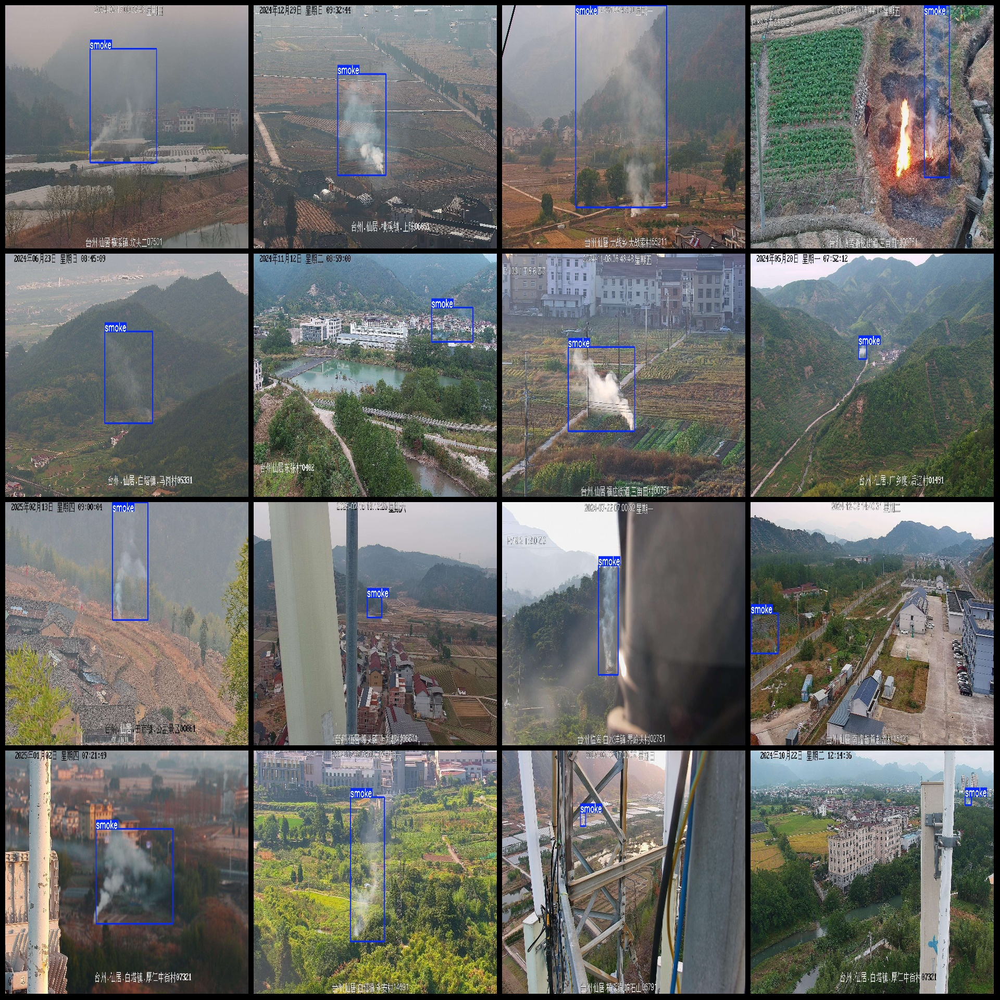
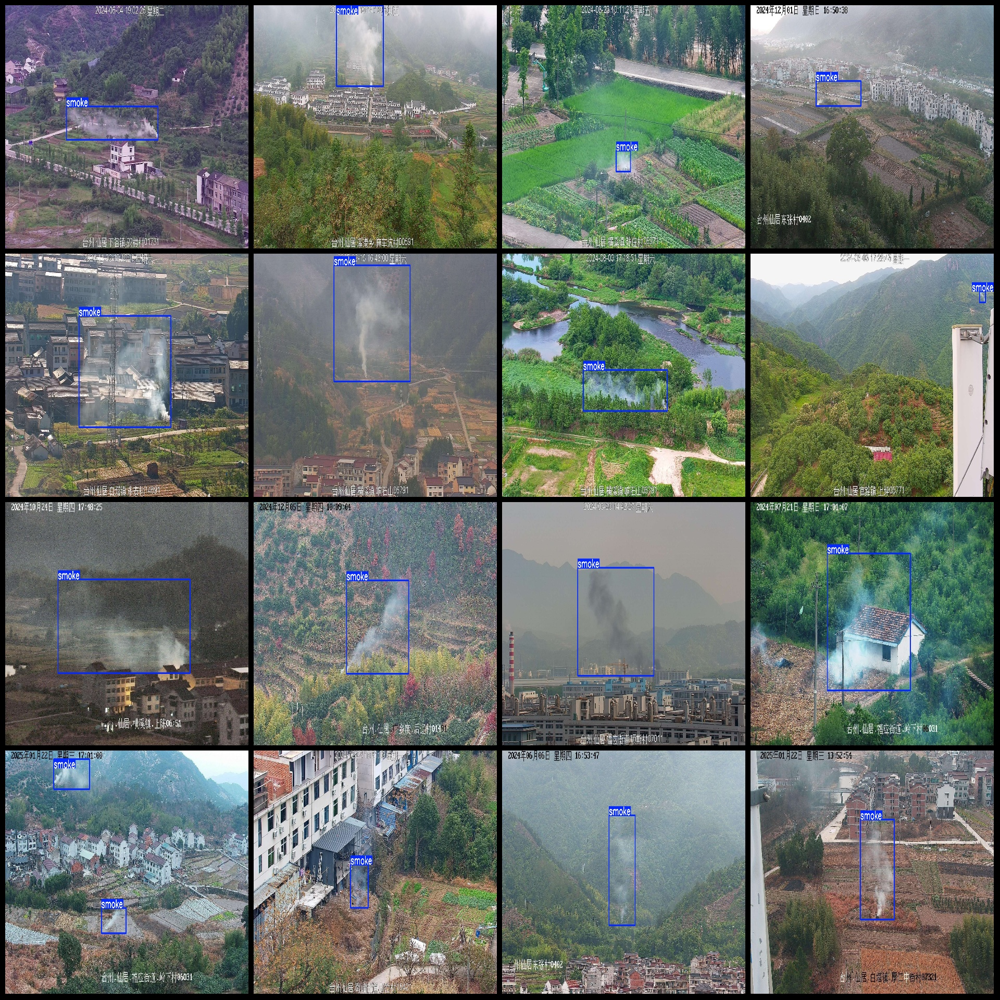

# UAV Perspective on Farmland Burning Straw Smoke Field Detection Data Set in VOC+YOLO Format with 2,767 Categories

Dataset Format: Pascal VOC format + YOLO format (without split path txt file, only containing jpg images and corresponding VOC format xml files and yolo format txt files)
Number of Image Files (jpg files): 2,767
Number of Annotation Files (xml files): 2,767
Number of Annotation Files (txt files): 2,767
Number of Classifications: 1
Classification Name: "smoke"
Number of Boxes for Each Classification:
smoke (Smoke) Boxes = 2807
Total Boxes: 2807
Image Resolution: 1920x1080
Drone: DJI MAVIC 3
Collection Height: 20m
Collection Angle: 60°
Annotation Tool: labelImg
Annotation Rules: Draw a rectangle around the category
Important Notice: The dataset does not have been divided into training, validation, and testing sets. You need to divide them yourself.
Special Remark: This dataset does not guarantee the accuracy of the trained models or weight files.
Image Preview:
Annotation Example:

## Images

Here is a pay link on Stripe ( https://buy.stripe.com/3cs8yP7sY87d0vu9AB ). Please contact me lonlonago@foxmail.com after funding $89, and I will send you a complete data files , thank you!

